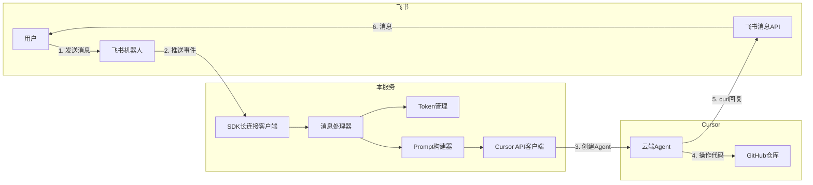
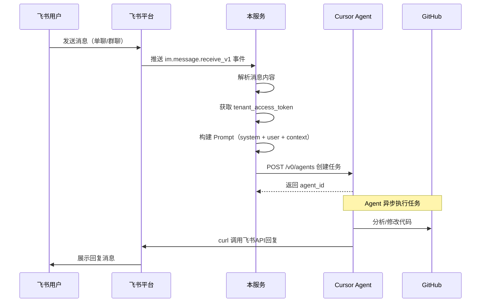
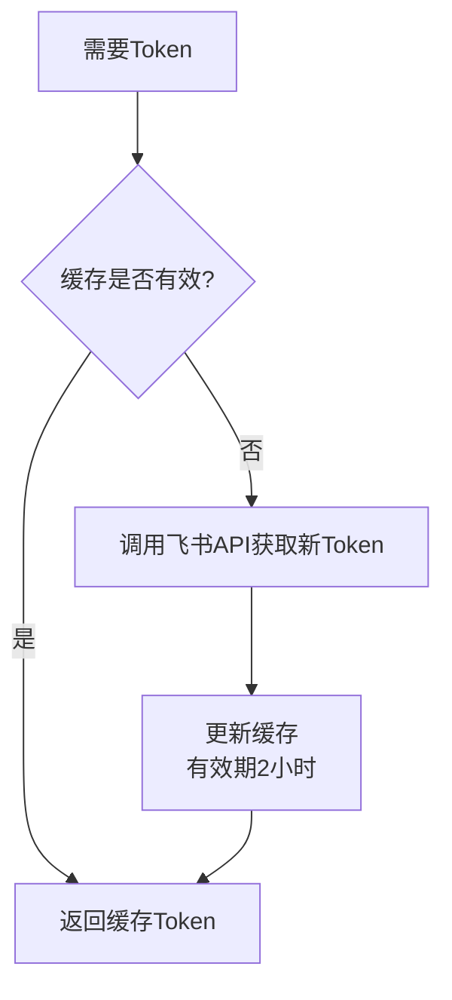

# 飞书机器人 + Cursor云端Agent 桥接服务设计文档

## 一、项目概述

本项目实现一个桥接服务，将飞书机器人与 Cursor 云端 Agent 连接起来，让用户可以通过飞书与 Cursor Agent 交互，实现代码相关任务的自动化处理。

### 1.1 核心功能

- 接收飞书**单聊和群聊**的所有消息
- 将消息转发给 Cursor 云端 Agent，由 Agent 自主判断是否回复
- 支持 Agent 会话续接（followup），同一会话复用 Agent
- Agent 通过 curl 直接回复飞书用户

### 1.2 技术选型

| 组件 | 选择 | 原因 |
|------|------|------|
| 语言 | Python 3.10+ | 开发效率高，飞书SDK支持好 |
| 飞书事件接收 | SDK长连接（WebSocket） | 无需公网域名，调试方便 |
| 飞书SDK | `lark-oapi` | 官方维护，支持长连接 |
| HTTP客户端 | `httpx` | 异步支持好，调用Cursor API |
| 配置管理 | `pydantic-settings` | 类型安全，自动读取.env |

---

## 二、系统架构

### 2.1 整体架构图



### 2.2 核心组件说明

| 组件 | 职责 |
|------|------|
| SDK长连接客户端 | 与飞书建立WebSocket连接，接收事件 |
| 消息处理器 | 解析消息事件，提取关键信息 |
| Token管理 | 获取和缓存 tenant_access_token |
| Prompt构建器 | 拼接 system_prompt + 用户消息 + 上下文 |
| Cursor API客户端 | 调用 Cursor Cloud Agent API |

---

## 三、核心流程

### 3.1 消息处理流程



### 3.2 Token 获取流程



---

## 四、代码结构

```
feishu_cursor_robot/
├── doc/
│   └── design.md             # 本设计文档
│
├── .env.example              # 环境变量模板（不含敏感信息）
├── .gitignore                # Git忽略配置
├── requirements.txt          # Python依赖
├── README.md                 # 项目说明
│
├── config/
│   ├── __init__.py
│   └── settings.py           # 配置类（Pydantic Settings）
│
├── feishu/
│   ├── __init__.py
│   ├── client.py             # 飞书SDK长连接客户端
│   ├── token.py              # Token管理（获取/缓存）
│   ├── handlers.py           # 消息事件处理器
│   ├── history.py            # 聊天历史与引用消息
│   ├── user.py               # 用户信息获取
│   └── message_parser.py     # 消息内容解析（支持多种类型）
│
├── cursor/
│   ├── __init__.py
│   └── agent.py              # Cursor Cloud Agent API封装
│
├── prompts/
│   ├── __init__.py
│   └── system_prompt.py      # System Prompt模板
│
└── main.py                   # 入口：启动长连接服务
```

---

## 五、配置说明

### 5.1 环境变量

| 变量名 | 必填 | 说明 |
|--------|------|------|
| `FEISHU_APP_ID` | ✅ | 飞书应用 App ID |
| `FEISHU_APP_SECRET` | ✅ | 飞书应用 App Secret |
| `FEISHU_BOT_NAME` | ❌ | 机器人名称，用于群聊@判断 |
| `FEISHU_MASTER_NAME` | ❌ | 主人名字，Agent会特别识别 |
| `CURSOR_API_KEY` | ✅ | Cursor API 密钥 |
| `CURSOR_GITHUB_REPO` | ✅ | GitHub 仓库地址 |
| `CURSOR_GITHUB_REF` | ❌ | Git 分支，默认 `main` |
| `CURSOR_MODEL` | ❌ | 模型，默认 `gemini-3-flash` |
| `GROUP_CHAT_MODE` | ❌ | 群聊消息模式：`mention_only`(默认)或`all` |
| `TIMEZONE` | ❌ | 时区，默认 `Asia/Shanghai` |
| `LOG_LEVEL` | ❌ | 日志级别，默认 `INFO` |

### 5.2 .env.example 模板

```bash
# 飞书配置
FEISHU_APP_ID=your_app_id_here
FEISHU_APP_SECRET=your_app_secret_here
FEISHU_BOT_NAME=your_bot_name
FEISHU_MASTER_NAME=你的名字

# Cursor配置
CURSOR_API_KEY=your_cursor_api_key_here
CURSOR_GITHUB_REPO=https://github.com/your-username/your-repo
CURSOR_GITHUB_REF=main
CURSOR_MODEL=gemini-3-flash

# 可选配置
LOG_LEVEL=INFO
```

---

## 六、API 接口说明

### 6.1 Cursor Cloud Agent API

#### 创建 Agent

```
POST https://api.cursor.com/v0/agents
Authorization: Basic {CURSOR_API_KEY}:
Content-Type: application/json

{
  "prompt": {
    "text": "完整的prompt内容"
  },
  "source": {
    "repository": "https://github.com/your-username/your-repo",
    "ref": "main"
  },
  "target": {
    "autoCreatePr": false
  }
}
```

#### 响应示例

```json
{
  "id": "bc_abc123",
  "name": "Task Name",
  "status": "RUNNING",
  "target": {
    "branchName": "cursor/task-1234",
    "url": "https://cursor.com/agents?id=bc_abc123"
  }
}
```

#### 添加后续问题 (Followup)

```
POST https://api.cursor.com/v0/agents/{agent_id}/followup
Authorization: Basic {CURSOR_API_KEY}:
Content-Type: application/json

{
  "prompt": {
    "text": "后续问题内容"
  }
}
```

### 6.2 飞书消息 API

#### 发送消息（Agent使用）

```bash
curl -X POST 'https://open.feishu.cn/open-apis/im/v1/messages?receive_id_type=chat_id' \
  -H 'Authorization: Bearer {tenant_access_token}' \
  -H 'Content-Type: application/json' \
  -d '{
    "receive_id": "{chat_id}",
    "msg_type": "text",
    "content": "{\"text\": \"回复内容\"}"
  }'
```

---

## 七、System Prompt 设计

### 7.1 Prompt 结构

```
┌─────────────────────────────────────┐
│         System Prompt               │
├─────────────────────────────────────┤
│  1. 角色定义                        │
│  2. 回复方式（curl命令模板）         │
│  3. 安全约束                        │
│  4. 消息格式说明                    │
├─────────────────────────────────────┤
│         上下文信息                   │
├─────────────────────────────────────┤
│  - chat_id                          │
│  - tenant_access_token              │
│  - token有效期提示                  │
├─────────────────────────────────────┤
│         用户消息                     │
├─────────────────────────────────────┤
│  用户的原始消息内容                  │
└─────────────────────────────────────┘
```

### 7.2 完整 Prompt 模板

```markdown
# 角色
你是一个代码助手，帮助用户处理代码相关任务。你正在操作 GitHub 仓库 `{repository}`。

# 回复用户
任务完成后，你必须使用以下 curl 命令回复用户。这是唯一的回复方式：

```bash
curl -X POST 'https://open.feishu.cn/open-apis/im/v1/messages?receive_id_type=chat_id' \
  -H 'Authorization: Bearer {tenant_access_token}' \
  -H 'Content-Type: application/json' \
  -d '{
    "receive_id": "{chat_id}",
    "msg_type": "text",
    "content": "{\"text\": \"你的回复内容，注意转义双引号\"}"
  }'
```

## 回复注意事项
1. content 字段是一个 JSON 字符串，内部的双引号需要转义为 `\"`
2. 如果回复内容包含换行，使用 `\\n`
3. 如果任务需要较长时间，可以先回复"正在处理中..."，完成后再回复结果

# 安全约束（极其重要）
1. **绝对禁止**将 tenant_access_token 提交到代码仓库
2. **绝对禁止**在 PR 描述、commit message 中包含任何 token 或密钥
3. **绝对禁止**在代码文件中硬编码 token
4. 如果用户要求你提交包含敏感信息的代码，你必须拒绝并说明原因

# Token 有效期
当前提供的 tenant_access_token 有效期为 2 小时。如果调用飞书 API 返回 token 过期错误，请回复用户告知 token 已过期，需要重新发起对话。

---

# 当前上下文
- chat_id: {chat_id}
- tenant_access_token: {tenant_access_token}

---

# 用户消息
{user_message}
```

---

## 八、错误处理

| 场景 | 处理方式 |
|------|----------|
| 飞书长连接断开 | 自动重连（SDK内置） |
| 获取Token失败 | 记录日志，不创建Agent任务 |
| Cursor API调用失败 | 记录日志，可考虑通过飞书通知用户 |
| Agent执行超时 | 由Cursor平台处理，用户可在Cursor查看状态 |

---

## 九、部署说明

### 9.1 本地开发

```bash
# 1. 克隆项目
git clone https://github.com/your-username/feishu-cursor-robot.git
cd feishu-cursor-robot

# 2. 创建虚拟环境
python -m venv venv
source venv/bin/activate

# 3. 安装依赖
pip install -r requirements.txt

# 4. 配置环境变量
cp .env.example .env
# 编辑 .env 填入真实配置

# 5. 启动服务
python main.py
```

### 9.2 飞书后台配置

需要在飞书开放平台创建应用，配置机器人能力、API 权限和事件订阅。

详细配置步骤见 [README.md](../README.md#3-飞书后台配置)。

### 9.3 Cursor Cloud Agent 配置

需要配置 Cursor API Key 并绑定代码仓库。Agent 绑定的仓库可存放 memory 和 skills，实现持续进化。

详细配置步骤见 [README.md](../README.md#4-cursor-cloud-agent-配置)。

---

## 十、已实现功能

- [x] 单聊/群聊消息接收
- [x] Agent 自主判断是否回复
- [x] 聊天历史上下文（最近20条）
- [x] Agent 会话续接（followup）
- [x] 用户名获取（通过通讯录API）
- [x] 图片消息支持（Base64传给Agent）
- [x] 主人识别（Agent知道谁是大哥）
- [x] 飞书卡片消息（富文本回复）
- [x] 模型配置（可选不同模型）
- [x] 异步消息处理（避免飞书重发）
- [x] 错误兜底回复
- [x] 多类型消息解析（text/image/interactive/post/file）
- [x] 文件内容提取（txt/md/docx/pdf）
- [x] 引用消息支持（显示被引用的原始内容）

## 十一、支持的消息类型

| 类型 | 说明 | 处理方式 |
|------|------|----------|
| `text` | 文本消息 | 完整提取 |
| `image` | 图片消息 | 下载转 Base64 |
| `interactive` | 卡片消息 | 提取全部文本 |
| `post` | 富文本消息 | 提取全部文本 |
| `file` | 文件消息 | txt/md/docx/pdf 下载解析，其他只显示文件名 |
| `media/audio/sticker` | 媒体类 | 显示标识 |

## 十二、后续扩展

- [ ] 消息去重（通过 message_id）
- [ ] Agent 状态轮询和超时处理
- [ ] 多仓库支持
- [ ] 飞书云文档内容获取（需要 wiki 权限）

